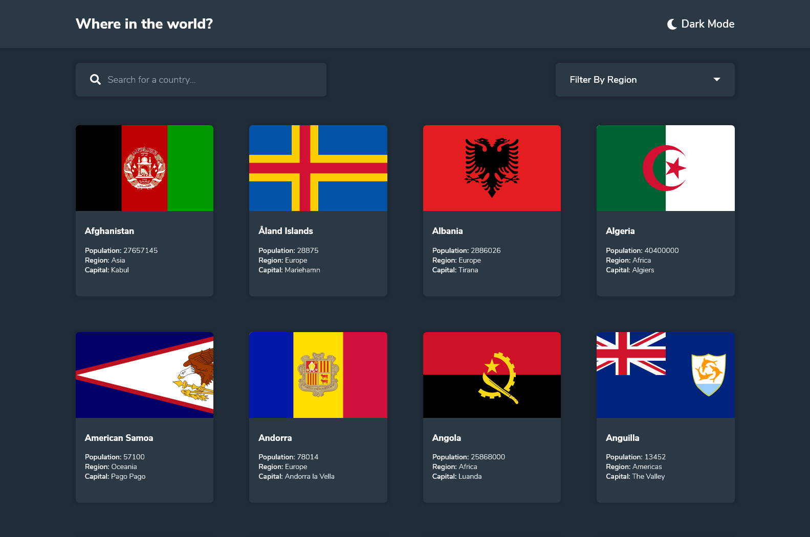

# Frontend Mentor - REST Countries API with color theme switcher solution

This is a solution to the [REST Countries API with color theme switcher challenge on Frontend Mentor](https://www.frontendmentor.io/challenges/rest-countries-api-with-color-theme-switcher-5cacc469fec04111f7b848ca). Frontend Mentor challenges help you improve your coding skills by building realistic projects.

## Table of contents

- [Overview](#overview)
  - [The challenge](#the-challenge)
  - [Screenshot](#screenshot)
  - [Links](#links)
- [My process](#my-process)
  - [Built with](#built-with)
  - [What I learned](#what-i-learned)
  - [Useful resources](#useful-resources)
- [Author](#author)

## Overview

### The challenge

Users should be able to:

- See all countries from the API on the homepage
- Search for a country using an `input` field
- Filter countries by region
- Click on a country to see more detailed information on a separate page
- Click through to the border countries on the detail page
- Toggle the color scheme between light and dark mode _(optional)_

### Screenshot



### Links

- Solution URL: [https://github.com/SyedZawwarAhmed/Rest-Countries-API](https://github.com/SyedZawwarAhmed/Rest-Countries-API)
- Live Site URL:[https://syedzawwarahmed.github.io/Countries-of-the-World/](https://syedzawwarahmed.github.io/Countries-of-the-World/)

## My process

### Built with

- Semantic HTML5 markup
- CSS custom properties
- Flexbox
- CSS Grid
- JavaScript

### What I learned

While making this project, the most important thing which I learned is the fetch API which is also the foundation of this website.

One other thing which I also learned is the local storage which I used for saving the user preference for theme (light/dark).

Here is the snippet of the fetch API I used in this project
```js
fetch("https://restcountries.eu/rest/v2/all")
  .then((res) => res.json())
  .then((data) => {
    countries = data;
    countries.forEach((country) => {
      main.innerHTML += `<div class="country"><div class="flag-container"></div><div class="country-details"><h2 class="country-name">${country.name}</h2><span><strong>Population: </strong>${country.population}</span><br><span><strong>Region: </strong>${country.region}</span><br><span><strong>Capital: </strong>${country.capital}</span></div></div>`;
    });
  });
```

### Useful resources

- [Stack Overflow](https://www.stackoverflow.com) - As always, when I got stuck, stackoverflow helped me get through.
- [w3Schools](https://www.w3schools.com) - In my opinion, this is the best website for documentation with easily understandable code examples.

## Author

- Syed Zawwar Ahmed
- Frontend Mentor - [@SyedZawwarAhmed](https://www.frontendmentor.io/profile/SyedZawwarAhmed)
- Github - [@SyedZawwarAhmed](https://github.com/SyedZawwarAhmed)
- Linkedin - [@SyedZawwarAhmed](https://www.linkedin.com/in/syed-zawwar-ahmed-b7345a1b8/)
